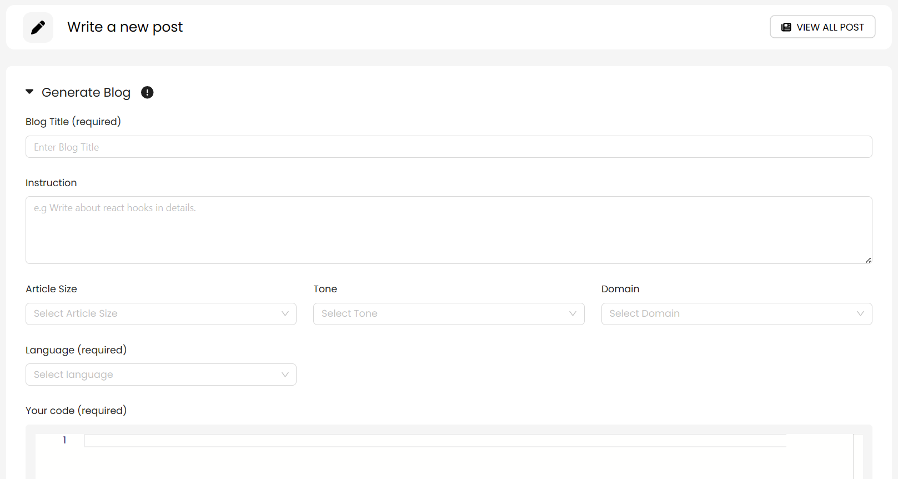
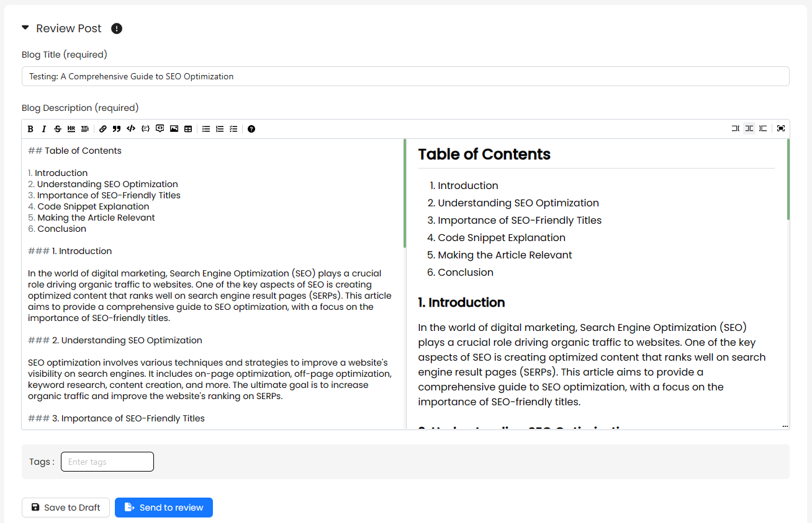
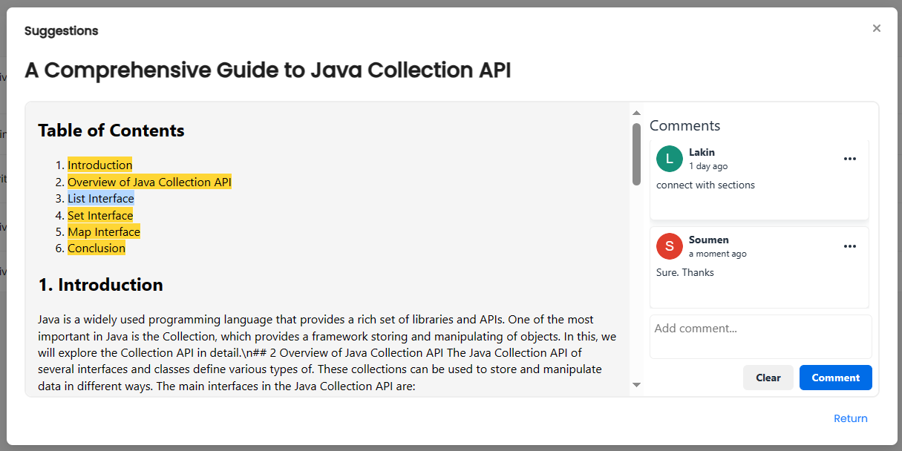
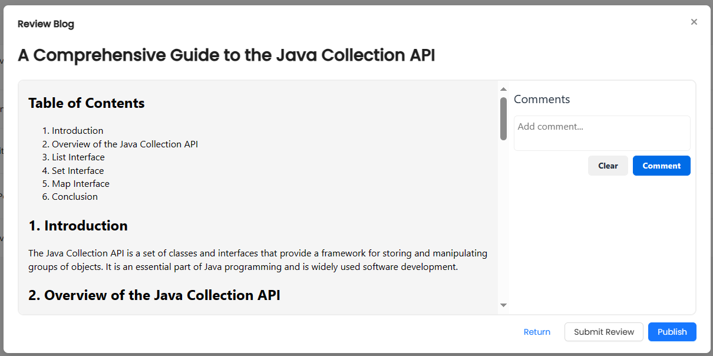
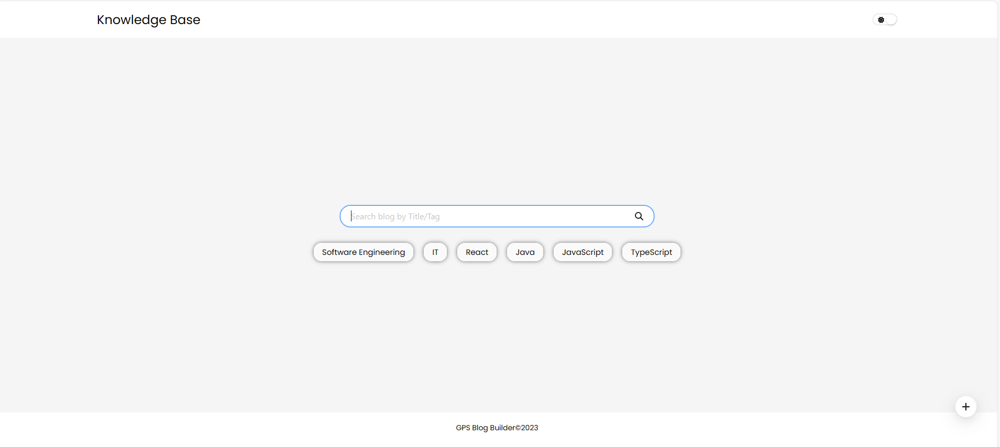

# Blog Builder Overview

The **Blog Builder** project is a dynamic and collaborative platform designed to simplify the process of creating, updating, and reviewing blogs. Leveraging the powerful capabilities of ChatGPT 3.5 Turbo, users can generate content seamlessly, while a robust workflow ensures efficient collaboration and content approval.

## Key Features

1. **Content Generation:**

   - Users can harness the natural language processing capabilities of ChatGPT 3.5 Turbo to generate blog content.
     

2. **User-Friendly Blog Creation:**

   - An intuitive interface allows users to easily create and customize their blogs, incorporating text, images, and other media elements.
     

3. **Collaborative Editing:**

   - Multiple users can collaborate in real-time, contributing to the creation and refinement of blog content.
     

4. **Approval Workflow:**

   - A structured workflow enables designated leads to review, comment, and approve blogs before publication.
     

5. **Version Control:**

   - Version control mechanisms track changes in blog content, ensuring transparency and accountability in the editing process.

6. **Search and Discovery:**
   - Users and visitors can efficiently search for and discover published blogs within the platform.
     

## Future Enhancements

- **Image Generation Module:**

  - Integration of an image generation module to enhance the visual appeal of blogs.

- **Advanced Search Features:**

  - Implementation of advanced search functionality for improved blog discovery.

- **Reader Engagement Features:**

  - Introduction of features such as liking, commenting, and sharing to enhance reader interaction.

- **User Analytics:**
  - Consideration of basic analytics features for users to track the performance of their published blogs.

The Blog Builder project aims to provide a seamless and enriching experience for both content creators and readers, fostering a vibrant and collaborative blogging community.
